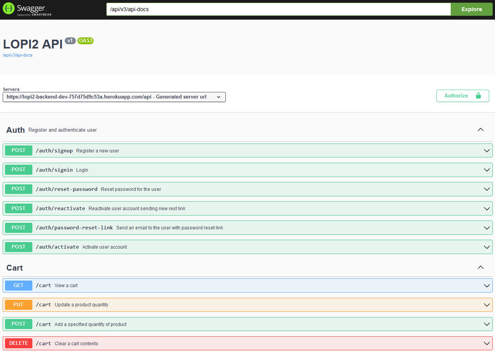
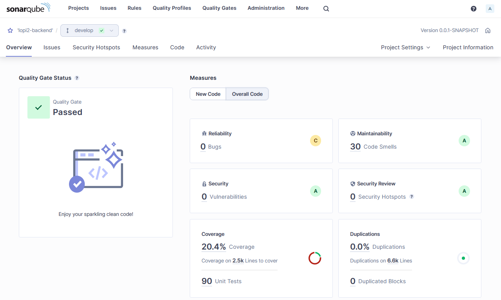

# Liftoff CMS - Backend

### Summary
Liftoff CMS - Backend is a comprehensive system designed to manage various aspects of an e-commerce platform. The core functionalities include:
- **Product Management:** Efficient handling of products, including the ability to add, edit, and delete products. Each product can be categorized for better organization.
- **User Management:** User accounts with roles and permissions are implemented, ensuring secure access for both administrators and customers.
- **Order Processing:** The system supports a seamless order processing workflow. It includes features such as order creation, tracking, and notifications via email to keep users informed about their orders.
- **Payment Integration:** Integration with PayU facilitates secure and convenient online payments, enhancing the overall user experience.
- **User Interaction:** Customers can leave comments and ratings on products, providing valuable feedback. The system also supports the storage and retrieval of product images.
- **Category Management:** Products are organized into categories for easy navigation and a well-structured product catalog.
- **Email Notifications:** Automated email notifications are implemented throughout the order processing cycle, keeping users updated on their orders and providing a smooth communication channel.

### Languages
This project was created with [Java](https://www.java.com) and [Spring Boot](https://spring.io/projects/spring-boot).
#### Additional Technologies and Tools
- **Database:** [PostgreSQL](https://www.postgresql.org/)
- **Code Quality:** [SonarQube](https://www.sonarsource.com/products/sonarqube/), [Qodana](https://www.jetbrains.com/qodana/)
- **Message Queue:** [RabbitMQ](https://www.rabbitmq.com/)
- **API Documentation:** [Swagger](https://swagger.io/)

#### Development and Testing Tools
- **Build Tool:** [Maven](https://maven.apache.org/)
- **Database Migration:** [Flyway](https://flywaydb.org/)
- **Testing:** [Spring Boot Test](https://docs.spring.io/spring-boot/docs/current/reference/html/boot-features-testing.html), [JUnit](https://junit.org/)

#### Security and Authentication
- **Security Framework:** [Spring Security](https://spring.io/projects/spring-security)
- **Authentication:** [JWT (JSON Web Token)](https://jwt.io/)
- **Data Validation:** [Spring Validation](https://docs.spring.io/spring-framework/docs/current/reference/html/web.html#mvc-ann-initbinder)

#### Cloud Services
- **Firebase Integration:** [Firebase Admin SDK](https://firebase.google.com/docs/admin/setup)

### Live Swagger
[Link...](https://lopi2-backend-dev-757d75d9c53a.herokuapp.com/api/swagger-ui/index.html#/)
### Screens

